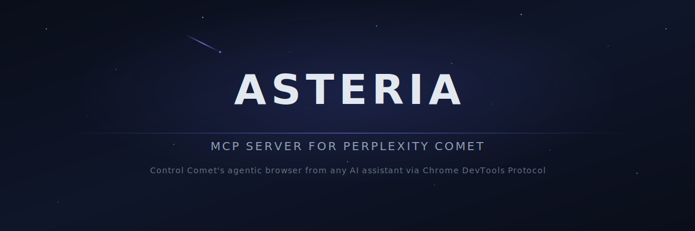

<!-- markdownlint-disable MD033 MD041 -->
<div align="center">
  <picture>
    <source media="(prefers-color-scheme: dark)" srcset="docs/assets/banner.svg">
    <source media="(prefers-color-scheme: light)" srcset="docs/assets/banner-light.svg">
    
  </picture>
  <h1>MCP Comet</h1>
  <h3>Turn Perplexity Comet into a production-grade MCP research engine</h3>
  <p>
    <a href="https://www.npmjs.com/package/@onestepat4time/mcp-comet"></a>
    <a href="https://www.npmjs.com/package/@onestepat4time/mcp-comet"></a>
    <a href="https://github.com/OneStepAt4time/mcp-comet/actions"></a>
    <a href="https://www.typescriptlang.org/"></a>
    <a href="LICENSE"></a>
  </p>
  <p><strong>7 modes</strong> · <strong>13 tools</strong> · zero-friction setup · full browser control</p>
  <p>
    <a href="#quick-start">Quick Start</a> ·
    <a href="docs/tools.md">Tool Reference</a> ·
    <a href="docs/architecture.md">Architecture</a> ·
    <a href="https://github.com/OneStepAt4time/mcp-comet/issues">Issues</a>
  </p>
</div>
<!-- markdownlint-enable MD033 MD041 -->

---

## Table of Contents

- [Why MCP Comet](#why-mcp-comet)
- [Demo](#demo)
- [Quick Start](#quick-start)
- [Research Modes](#research-modes)
- [Toolset at a Glance](#toolset-at-a-glance)
- [Agent Workflows](#agent-workflows)
- [CLI Power Ops](#cli-power-ops)
- [Architecture](#architecture)
- [Configuration](#configuration)
- [Compatibility](#compatibility)
- [Contributing](#contributing)
- [License](#license)

---

## Why MCP Comet

MCP Comet gives your agent more than a chat box. It gives your agent a complete research cockpit.

- Run high-quality web research in Comet directly from MCP clients.
- Switch between 7 purpose-built research modes instantly.
- Pull sources, screenshots, conversations, tabs, and full page content.
- Stay resilient with auto-connect, reconnect logic, and selector fallback strategies.

If your workflow is "ask, verify, cite, and iterate", this is the server built for it.

---

## Quick Start

## Installation

### Option 1: Global install (recommended)

```bash
npm install -g @onestepat4time/mcp-comet
```

### Option 2: Run without install

```bash
npx -y @onestepat4time/mcp-comet
```

### Option 3: Local development

```bash
git clone https://github.com/OneStepAt4time/mcp-comet.git
cd mcp-comet
npm ci
npm run build
```

---

### 1. Prerequisites

- Node.js >= 18
- [Perplexity Comet](https://comet.perplexity.ai/) installed

Optional pre-flight check:

```bash
mcp-comet detect
```

### 2. Add MCP Comet to MCP

Use one of these configs.

Claude Desktop (`~/.claude/claude_desktop_config.json`):

```json
{
  "mcpServers": {
    "mcp-comet": {
      "type": "stdio",
      "command": "mcp-comet",
      "args": ["start"]
    }
  }
}
```

Cursor (`~/.cursor/mcp.json`):

```json
{
  "mcpServers": {
    "mcp-comet": {
      "type": "stdio",
      "command": "mcp-comet",
      "args": ["start"]
    }
  }
}
```

### 3. Give your agent a mission

Prompt your agent with something like:

> Use Comet in deep-research mode to analyze the global battery supply chain in 2026. Return a structured summary with all cited sources.

Your agent can chain `comet_mode`, `comet_ask`, `comet_wait`, and `comet_get_sources` automatically.

---

## Research Modes

Choose the mode that matches the job.

- `standard`: fast factual lookups. Example: "What is the latest CPI reading for Canada?"
- `deep-research`: multi-source investigations. Example: "Map the 2026 AI chip supply chain and major risks."
- `model-council`: multi-perspective reasoning. Example: "Debate arguments for and against UBI with tradeoffs."
- `create`: drafting and ideation. Example: "Draft a technical explainer on WebAssembly in edge runtimes."
- `learn`: guided teaching. Example: "Teach me B-trees step by step with examples."
- `review`: critical analysis. Example: "Review this API design for security and reliability gaps."
- `computer`: browser-interactive tasks. Example: "Open arXiv and find the newest papers on retrieval augmentation."

CLI example:

```bash
mcp-comet call comet_mode '{"mode":"deep-research"}'
mcp-comet call comet_ask '{"prompt":"Analyze current fusion startups by funding and milestones"}'
mcp-comet call comet_wait
mcp-comet call comet_get_sources
```

---

## Toolset at a Glance

### Session

- `comet_connect`: connects to Comet or launches it.
- `comet_poll`: returns live status and partial progress.
- `comet_wait`: waits for completion and returns the full response.
- `comet_stop`: stops a running task.

### Query

| Tool         | What It Does                          |
| ------------ | ------------------------------------- |
| `comet_ask`  | Sends a prompt to Comet               |
| `comet_mode` | Gets or switches active research mode |

### Content

| Tool                     | What It Does                                       |
| ------------------------ | -------------------------------------------------- |
| `comet_screenshot`       | Captures PNG/JPEG screenshots                      |
| `comet_get_sources`      | Extracts references, including collapsed citations |
| `comet_get_page_content` | Extracts page title and readable text              |

### Navigation

| Tool                       | What It Does                       |
| -------------------------- | ---------------------------------- |
| `comet_list_tabs`          | Lists tabs by category             |
| `comet_switch_tab`         | Jumps to a tab by id or title      |
| `comet_list_conversations` | Lists sidebar conversations        |
| `comet_open_conversation`  | Opens a specific conversation      |

Full reference: [docs/tools.md](docs/tools.md)

---

## Agent Workflows

| Goal | Flow |
| ---- | ---- |
| Deep research with citations | `comet_connect` -> `comet_mode(deep-research)` -> `comet_ask` -> `comet_wait` -> `comet_get_sources` |
| Multi-perspective debate | `comet_mode(model-council)` -> `comet_ask` -> `comet_wait` |
| Visual evidence capture | `comet_screenshot` -> pass image into your vision-capable model |
| Resume old investigations | `comet_list_conversations` -> `comet_open_conversation` -> `comet_get_page_content` |

---

## CLI Power Ops

Install globally:

```bash
npm install -g @onestepat4time/mcp-comet
```

Use directly:

```bash
# connectivity and diagnostics
mcp-comet detect
mcp-comet call comet_connect

# ask + wait pattern
mcp-comet call comet_ask '{"prompt":"What are the top AI safety papers this week?"}'
mcp-comet call comet_wait

# source extraction
mcp-comet call comet_get_sources
```

No install option:

```bash
npx -y @onestepat4time/mcp-comet
```

---

## Architecture

```text
MCP Tools
   -> UI Automation
      -> CDP Transport
         -> Perplexity Comet
```

- Ordered selector strategies tolerate Comet UI changes.
- Automatic version detection selects the correct selector set.
- Auto-reconnect includes health checks with retry backoff.
- Source extraction uses a second pass to expand collapsed citations.

Deep dive: [docs/architecture.md](docs/architecture.md)

---

## Configuration Essentials

Most teams only tune these three:

| Variable                 | Default       | Change It When                           |
| ------------------------ | ------------- | ---------------------------------------- |
| `COMET_RESPONSE_TIMEOUT` | `180000`      | Queries are long and timing out          |
| `COMET_PATH`             | auto-detect   | Comet is in a non-standard install path  |
| `COMET_LOG_LEVEL`        | `info`        | You need debug logs                      |

Config file (`mcp-comet.config.json`) example:

```json
{
  "responseTimeout": 300000,
  "logLevel": "debug"
}
```

More options and full env var reference: [docs/configuration.md](docs/configuration.md)

---

## Compatibility

| Chrome Version | Selector Set | Status    |
| -------------- | ------------ | --------- |
| 145            | v145         | Supported |

Unknown versions fall back to the latest known selector set.

Details and upgrade flow: [docs/comet-compatibility.md](docs/comet-compatibility.md)

---

## Contributing

PRs are welcome. Before opening one:

```bash
npm run lint && npm test
```

Guide: [docs/contributing.md](docs/contributing.md)

## Feedback

- Issues: <https://github.com/OneStepAt4time/mcp-comet/issues>

## License

[MIT](LICENSE)

Built by [OneStepAt4time](https://github.com/OneStepAt4time)
