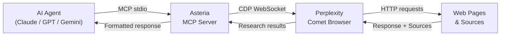
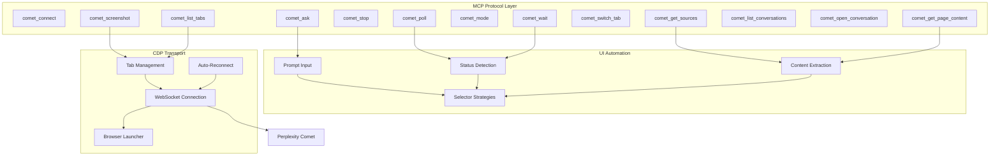

<p align="center">
  
</p>

<p align="center">
  <a href="https://github.com/OneStepAt4time/asteria/releases"></a>
  <a href="https://github.com/OneStepAt4time/asteria/actions/workflows/ci.yml"></a>
  <a href="https://github.com/OneStepAt4time/asteria/blob/master/LICENSE"></a>
  
  
  <a href="https://modelcontextprotocol.io"></a>
  
</p>

<p align="center">
  <strong>Give any AI agent direct control over <a href="https://comet.perplexity.ai/">Perplexity Comet</a> via the Model Context Protocol.</strong>
</p>

---

## How It Works

Asteria is an [MCP server](https://modelcontextprotocol.io) that bridges AI assistants with [Perplexity Comet](https://comet.perplexity.ai/) — the agentic browser that researches, browses, and answers questions autonomously. Unlike simple search APIs, Comet navigates pages, follows links, and reasons over live web content. Asteria exposes all of that through 13 MCP tools via Chrome DevTools Protocol (CDP), with no Puppeteer or Playwright dependencies.



The agent sends a prompt through MCP. Asteria connects to Comet over CDP, submits the query, monitors Comet's agentic research cycle, and returns the full response with cited sources.

---

## Features

| | Feature | Description |
|---|---------|-------------|
| 🔌 | **13 MCP tools** | Connect, ask, poll, wait, stop, screenshot, mode switch, tab management, source extraction, conversation history, page content |
| ⚡ | **Non-blocking polling** | Submit a prompt and poll for completion — the agent keeps working while Comet researches |
| ⏳ | **Blocking wait** | `comet_wait` blocks until Comet finishes, ideal when `comet_ask` times out mid-response |
| 🔍 | **Auto-detect Comet** | Finds Comet on Windows, macOS, and Linux; launches it with the correct debug port |
| 🔄 | **Auto-reconnect** | Exponential backoff with health checks — survives Comet restarts without dropping the session |
| 🧠 | **Version-aware selectors** | Auto-detects Comet's Chrome version and routes to the correct CSS selectors |
| 📑 | **Tab categorization** | Tracks main, sidecar, agent-browsing, and overlay tabs separately |
| 🚫 | **Zero browser dependencies** | No Puppeteer or Playwright — uses CDP directly via `chrome-remote-interface` |
| 🛠️ | **CLI included** | `asteria detect` to check installation, `asteria snapshot` to capture DOM structure |

---

## Requirements

- **Node.js** >= 18
- **[Perplexity Comet](https://comet.perplexity.ai/)** installed and running
- **Windows**, **macOS**, or **Linux** (Linux requires setting `COMET_PATH`)

---

## Installation

```bash
npm install -g @onestepat4time/asteria
```

---

## Quick Start

### 1. Add to your MCP client config

**Claude Code** (`~/.claude/claude_desktop_config.json`):
```json
{
  "mcpServers": {
    "asteria": {
      "type": "stdio",
      "command": "asteria",
      "args": ["start"]
    }
  }
}
```

**Cursor** (`~/.cursor/mcp.json`) — same format.

### 2. Make sure Comet is running

Open Perplexity Comet on your machine. Asteria auto-detects the running instance.

### 3. Use in your agent

```
> Ask Perplexity what the latest AI research papers are this week
```

Asteria connects to Comet, sends the query, waits for the full research response, and returns it with cited sources to your assistant.

---

## Tools

| Tool | Description | Docs |
|------|-------------|------|
| `comet_connect` | Connect to or launch Perplexity Comet | [Reference](docs/tools.md) |
| `comet_ask` | Send a prompt and start an agentic search | [Reference](docs/tools.md) |
| `comet_poll` | Check current agent status, steps, and response content | [Reference](docs/tools.md) |
| `comet_wait` | Block until the agent finishes responding; use after `comet_ask` times out | [Reference](docs/tools.md) |
| `comet_stop` | Stop the currently running agent | [Reference](docs/tools.md) |
| `comet_screenshot` | Capture a screenshot of the active tab | [Reference](docs/tools.md) |
| `comet_mode` | Get or switch the search mode (standard, deep-research, model-council, etc.) | [Reference](docs/tools.md) |
| `comet_list_tabs` | List all open tabs by category (main, sidecar, agent-browsing, overlay) | [Reference](docs/tools.md) |
| `comet_switch_tab` | Switch focus to a specific tab by ID or title | [Reference](docs/tools.md) |
| `comet_get_sources` | Extract cited sources from the current response | [Reference](docs/tools.md) |
| `comet_list_conversations` | List recent conversation links visible on the page | [Reference](docs/tools.md) |
| `comet_open_conversation` | Navigate to a specific conversation URL | [Reference](docs/tools.md) |
| `comet_get_page_content` | Extract full text from the active page | [Reference](docs/tools.md) |

---

## CLI

```bash
asteria start      # Start MCP stdio server
asteria detect     # Detect Comet installation path and debug port
asteria --version  # Print version
asteria --help     # Print help
```

---

## Configuration

All settings can be overridden via environment variables:

| Variable | Default | Description |
|----------|---------|-------------|
| `ASTERIA_PORT` | `9222` | CDP debug port |
| `COMET_PATH` | auto-detect | Path to Comet executable |
| `ASTERIA_LOG_LEVEL` | `info` | Log level: `debug` / `info` / `warn` / `error` |
| `ASTERIA_TIMEOUT` | `30000` | Comet launch timeout (ms) |
| `ASTERIA_RESPONSE_TIMEOUT` | `120000` | Max wait for response (ms) |
| `ASTERIA_POLL_INTERVAL` | `1000` | Status poll interval (ms) |
| `ASTERIA_SCREENSHOT_FORMAT` | `png` | Screenshot format: `png` / `jpeg` |
| `ASTERIA_MAX_RECONNECT` | `5` | Max reconnection attempts |
| `ASTERIA_RECONNECT_DELAY` | `5000` | Max reconnection backoff delay (ms) |

See [Configuration](docs/configuration.md) for the full reference.

---

## Guides

| Guide | Description |
|-------|-------------|
| [Tool Reference](docs/tools.md) | All 13 tools with parameters, return values, and examples |
| [Integration Guide](docs/integration.md) | Set up with Claude Code, Cursor, or custom MCP clients |
| [Configuration](docs/configuration.md) | Environment variables and config files |
| [Troubleshooting](docs/troubleshooting.md) | Common issues and error codes |
| [Architecture](docs/architecture.md) | How Asteria works internally |

---

## Architecture



---

## Roadmap

- [ ] **Streaming responses** — stream Comet responses token-by-token instead of polling
- [ ] **MCP Resources** — expose Perplexity pages as MCP resources for direct reading
- [ ] **Multi-Comet sessions** — control multiple Comet instances simultaneously
- [ ] **HTTP/SSE transport** — support N8N and REST clients in addition to stdio
- [ ] **Browser extension** — package as a browser extension for tighter integration

---

## Contributing

Contributions are welcome. Open an issue before submitting large PRs.

```bash
git clone https://github.com/OneStepAt4time/asteria.git
cd asteria
npm install
npm run build
npm test
```

See [Contributing](docs/contributing.md) for code style, adding Comet versions, and commit conventions.

---

## Support the Project

If Asteria saves you time, consider sponsoring:

<p align="center">
  <a href="https://github.com/sponsors/OneStepAt4time"></a>
  &nbsp;
  <a href="https://ko-fi.com/onestepat4time"></a>
</p>

---

## License

MIT &copy; 2026 [OneStepAt4time](https://github.com/OneStepAt4time)
