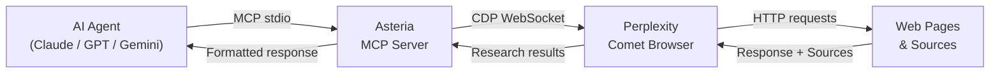
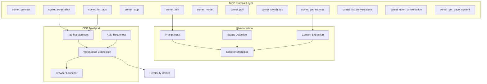

<p align="center">
  
</p>

<p align="center">
  <a href="https://github.com/OneStepAt4time/asteria/releases"></a>
  <a href="https://github.com/OneStepAt4time/asteria/blob/master/LICENSE"></a>
  <a href="https://github.com/OneStepAt4time/asteria/actions/workflows/ci.yml"></a>
  
  <a href="https://modelcontextprotocol.io"></a>
  
</p>

<p align="center">
  <strong>Give any AI agent direct control over <a href="https://comet.perplexity.ai/">Perplexity Comet</a> via the Model Context Protocol.</strong>
</p>

---

## What is Asteria?

Asteria is an [MCP server](https://modelcontextprotocol.io) that bridges your AI assistant (Claude Code, OpenClaw, Cursor, or any MCP client) with [Perplexity Comet](https://comet.perplexity.ai/) — the agentic browser that researches, browses, and answers questions autonomously.

Unlike simple search APIs, Comet can **navigate pages, follow links, and reason over live web content**. Asteria exposes all of that through 12 clean MCP tools via Chrome DevTools Protocol (CDP) — no Puppeteer, no Playwright.



---

## Demo

<p align="center">
  
  <br>
  <em>Claude Code calls <code>comet_ask</code> → Comet researches the web → sources and answer flow back to the agent</em>
</p>

> **GIF coming soon.** Star the repo to get notified on release.

---

## Features

| | Feature | Description |
|---|---------|-------------|
| 🔌 | **12 MCP tools** | Connect, ask, poll, stop, screenshot, mode switch, tab management, source extraction, conversation history |
| ⚡ | **Non-blocking polling** | Submit a prompt and poll for completion — agent keeps working while Comet researches |
| 🔍 | **Auto-detect Comet** | Finds Comet on Windows and macOS, launches it with the correct debug port |
| 🔄 | **Auto-reconnect** | Exponential backoff with health checks — survives Comet restarts without dropping the session |
| 🧠 | **Version-aware selectors** | Auto-detects Comet's Chrome version and routes to the right CSS selectors |
| 📑 | **Tab categorization** | Tracks main, sidecar, agent-browsing, and overlay tabs separately |
| 🚫 | **Zero browser dependencies** | No Puppeteer or Playwright — uses CDP directly via `chrome-remote-interface` |
| 🛠️ | **CLI included** | `asteria detect` to check installation, `asteria snapshot` to capture DOM structure |

---

## Requirements

- **Node.js** >= 18
- **[Perplexity Comet](https://comet.perplexity.ai/)** installed and running
- **Windows** or **macOS** (Linux: manual `COMET_PATH` required)

---

## Installation

```bash
npm install -g @onestepat4time/asteria
```

> **Note:** The package is currently in active development. Until published to npm, install from source:
> ```bash
> git clone https://github.com/OneStepAt4time/asteria.git
> cd asteria && npm install && npm run build && npm link
> ```

---

## Quick Start

### 1. Add to your MCP client config

**Claude Code** (`~/.claude/claude_desktop_config.json`):
```json
{
  "mcpServers": {
    "asteria": {
      "type": "stdio",
      "command": "asteria",
      "args": ["start"]
    }
  }
}
```

**Cursor** (`~/.cursor/mcp.json`) — same format.

### 2. Make sure Comet is running

Open Perplexity Comet on your machine. Asteria auto-detects it.

### 3. Use in your agent

```
> Ask Perplexity what the latest AI research papers are this week
```

Asteria launches (or connects to) Comet, sends the query, waits for the full research response, and returns it — with cited sources — to your assistant.

---

## Tools

| Tool | Description | Example Use Case |
|------|-------------|------------------|
| `comet_connect` | Connect to or launch Perplexity Comet | Start a session before other tools |
| `comet_ask` | Send a prompt and start an agentic search | "Summarize the latest news about quantum computing" |
| `comet_poll` | Check current agent status | Monitor long research queries non-blocking |
| `comet_stop` | Stop the running agent | Cancel a query that's taking too long |
| `comet_screenshot` | Capture a screenshot of the active tab | Visually verify what Comet is showing |
| `comet_mode` | Get or switch search mode | Switch to Deep Research for thorough analysis |
| `comet_list_tabs` | List all open tabs by category | See what pages Comet opened during research |
| `comet_switch_tab` | Switch focus to a specific tab | Read content from an agent-browsed page |
| `comet_get_sources` | Extract cited sources from the last response | Get the URLs Comet cited in its answer |
| `comet_list_conversations` | List recent Comet conversations | Find a previous search to reference |
| `comet_open_conversation` | Open a conversation by URL | Resume a past research session |
| `comet_get_page_content` | Extract full text from the active page | Read what Comet found on a browsed page |

---

## CLI

```bash
asteria start      # Start MCP stdio server
asteria detect     # Detect Comet installation path and debug port
asteria --version  # Print version
asteria --help     # Print help
```

---

## Configuration

All settings can be overridden via environment variables:

| Variable | Default | Description |
|----------|---------|-------------|
| `ASTERIA_PORT` | `9222` | CDP debug port |
| `COMET_PATH` | auto-detect | Path to Comet executable |
| `ASTERIA_LOG_LEVEL` | `info` | Log level: `debug` / `info` / `warn` / `error` |
| `ASTERIA_TIMEOUT` | `30000` | Comet launch timeout (ms) |
| `ASTERIA_RESPONSE_TIMEOUT` | `120000` | Max wait for response (ms) |
| `ASTERIA_POLL_INTERVAL` | `1000` | Status poll interval (ms) |
| `ASTERIA_SCREENSHOT_FORMAT` | `png` | Screenshot format: `png` / `jpeg` |
| `ASTERIA_MAX_RECONNECT` | `5` | Max reconnection attempts |
| `ASTERIA_RECONNECT_DELAY` | `5000` | Max reconnection backoff delay (ms) |

---

## How It Works

### Connection Flow

1. **`comet_connect`** — checks if Comet is running on port 9222, launches it if not, closes extra tabs
2. **`comet_ask`** — types the prompt into Comet's input field, submits it, begins polling
3. **Status detection** — monitors stop buttons, spinners, and body text to detect `working` / `idle` / `completed`
4. **Response extraction** — reads prose elements, filters UI chrome, returns clean text + sources

### Architecture



---

## Roadmap

- [ ] **npm publish** — release `@onestepat4time/asteria` to the public registry
- [ ] **Streaming responses** — stream Comet responses token-by-token instead of polling
- [ ] **MCP Resources** — expose Perplexity pages as MCP resources for direct reading
- [ ] **Multi-Comet sessions** — control multiple Comet instances simultaneously
- [ ] **HTTP/SSE transport** — support N8N and REST clients in addition to stdio
- [ ] **Browser extension** — package as a browser extension for tighter integration

---

## Contributing

Contributions are welcome! Please open an issue before submitting large PRs.

```bash
git clone https://github.com/OneStepAt4time/asteria.git
cd asteria
npm install
npm run build
npm test
```

See [contributing.md](docs/contributing.md) for code style, adding Comet versions, and commit conventions.

---

## Support the Project

If Asteria saves you time, consider:

<p align="center">
  <a href="https://github.com/sponsors/OneStepAt4time"></a>
  &nbsp;
  <a href="https://ko-fi.com/onestepat4time"></a>
</p>

---

## License

MIT © 2026 [OneStepAt4time](https://github.com/OneStepAt4time)
