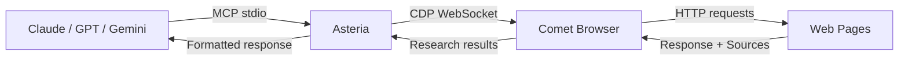
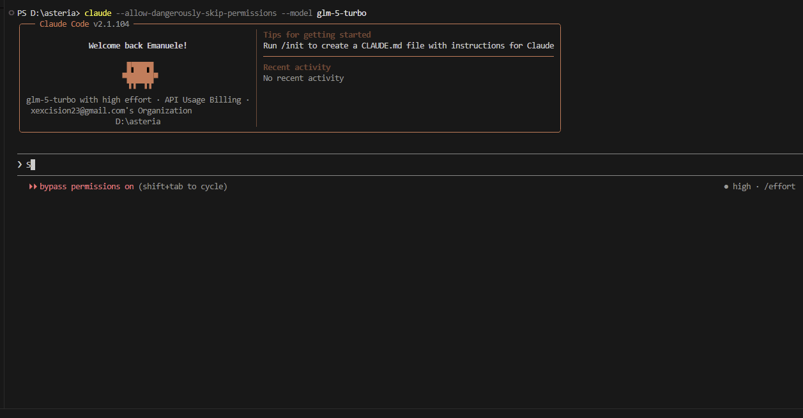
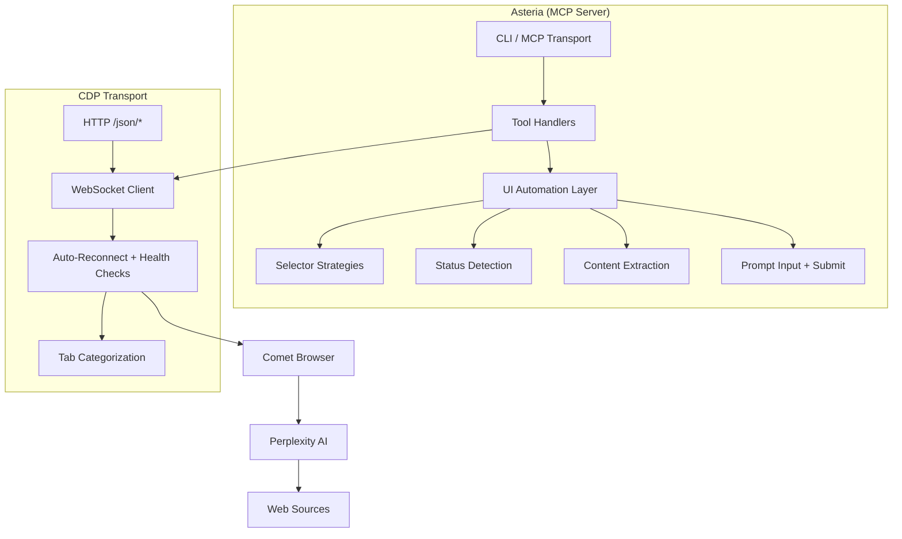
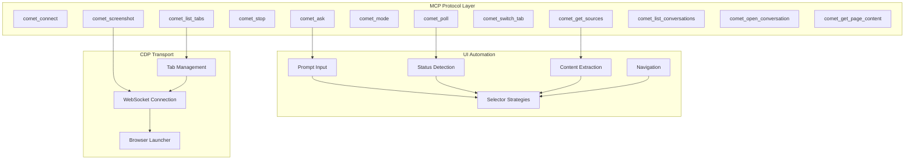

<p align="center">
  
</p>

<p align="center">
  <a href="https://www.npmjs.com/package/asteria"></a>
  <a href="https://www.npmjs.com/package/asteria"></a>
  <a href="https://github.com/OneStepAt4time/asteria/blob/master/LICENSE"></a>
  <a href="https://github.com/OneStepAt4time/asteria"></a>
  <a href="https://github.com/OneStepAt4time/asteria/actions/workflows/ci.yml"></a>
  <a href="https://modelcontextprotocol.io"></a>
</p>

---

## What is Asteria?

Asteria is an [MCP server](https://modelcontextprotocol.io) that gives any AI assistant direct control over [Perplexity Comet](https://comet.perplexity.ai/) — the agentic browser that researches, browses, and answers questions autonomously.

It connects via Chrome DevTools Protocol, so your AI agent can ask questions, follow up, extract sources, manage tabs, and monitor Comet's research progress — all through standard MCP tools.



## Demo

<p align="center">
  
  <br>
  <em>Claude Code asks a question through Asteria → Comet researches and responds → the agent continues its workflow</em>
</p>

## Features

- **12 MCP tools** — connect, ask, poll, stop, screenshot, mode switch, tab management, source extraction, conversation history
- **Non-blocking polling** — submit a prompt and poll for completion; the agent can do other work while Comet researches
- **Auto-detect Comet** — finds the Comet executable on Windows and macOS, launches it with the correct debug port
- **Auto-reconnect** — exponential backoff with health checks; survives Comet restarts without dropping the session
- **Version-aware selectors** — auto-detects Comet's Chrome version and routes to the right CSS selectors
- **Tab categorization** — tracks main, sidecar, agent browsing, and overlay tabs separately
- **Zero browser dependencies** — no Puppeteer or Playwright; uses CDP directly via `chrome-remote-interface`
- **CLI included** — `asteria detect` to check installation, `asteria snapshot` to capture DOM structure

## Install

```bash
npm install -g asteria
```

**Requirements:** Node.js >= 18, [Perplexity Comet](https://comet.perplexity.ai/) installed

## Quick Start

Add to your MCP client configuration:

```json
{
  "mcpServers": {
    "asteria": {
      "type": "stdio",
      "command": "asteria",
      "args": ["start"]
    }
  }
}
```

Then connect from your AI assistant:

```
> Ask Perplexity what the latest AI research papers are
```

Asteria will launch (or connect to) Comet, send the query, wait for the full research response, and return it to your assistant.

## How It Works



### Connection Flow

1. **`comet_connect`** — checks if Comet is running on port 9222, launches it if not, closes extra tabs
2. **`comet_ask`** — types the prompt into Comet's input field, submits it, polls for completion
3. **Status detection** — monitors stop buttons, spinners, and body text patterns to detect working/idle/completed states
4. **Response extraction** — reads prose elements, filters out UI chrome, returns cleaned response text

## CLI

```bash
asteria start       # Start MCP stdio server (default)
asteria detect      # Detect Comet installation and debug port
asteria --version   # Print version
asteria --help      # Print help
```

## Tools

| Tool | Description | Example Use Case |
|------|-------------|-----------------|
| `comet_connect` | Connect to or launch Perplexity Comet | Start a session before other tools |
| `comet_ask` | Send a prompt and wait for response | "Summarize the latest news about quantum computing" |
| `comet_poll` | Check current agent status | Monitor long research queries |
| `comet_stop` | Stop the running agent | Cancel a query that's taking too long |
| `comet_screenshot` | Capture tab screenshot | Visually verify what Comet is showing |
| `comet_mode` | Get or switch search mode | Switch to Research for deeper analysis |
| `comet_list_tabs` | List categorized browser tabs | See what pages Comet opened during research |
| `comet_switch_tab` | Switch to a specific tab | Read content from an agent-browsing page |
| `comet_get_sources` | Extract response sources | Get the cited URLs from a research response |
| `comet_list_conversations` | List recent conversations | Find a previous search to reference |
| `comet_open_conversation` | Open a conversation URL | Resume a past research session |
| `comet_get_page_content` | Extract page text content | Read what Comet found on a browsed page |

## Configuration

| Env Var | Default | Description |
|---------|---------|-------------|
| `ASTERIA_PORT` | 9222 | CDP debug port |
| `COMET_PATH` | auto-detect | Path to Comet executable |
| `ASTERIA_LOG_LEVEL` | info | Log level (`debug` / `info` / `warn` / `error`) |
| `ASTERIA_TIMEOUT` | 30000 | Comet launch timeout (ms) |
| `ASTERIA_RESPONSE_TIMEOUT` | 120000 | Response poll timeout (ms) |
| `ASTERIA_POLL_INTERVAL` | 1000 | Status poll interval (ms) |
| `ASTERIA_SCREENSHOT_FORMAT` | png | Screenshot format (`png` / `jpeg`) |
| `ASTERIA_MAX_RECONNECT` | 5 | Max reconnection attempts |
| `ASTERIA_RECONNECT_DELAY` | 5000 | Max reconnection backoff delay (ms) |

## Architecture



## Roadmap

- [ ] **MCP Resources** — expose Perplexity pages as MCP resources for direct reading
- [ ] **Streaming responses** — stream Comet responses token-by-token instead of polling
- [ ] **Multi-Comet sessions** — control multiple Comet instances simultaneously
- [ ] **Browser extension** — package as a browser extension for tighter integration

## Contributing

```bash
git clone https://github.com/OneStepAt4time/asteria.git
cd asteria
npm install
npm run build
npm test
```

See [contributing.md](docs/contributing.md) for code style, adding Comet versions, and commit conventions.

## License

MIT &copy; 2026 [OneStepAt4time](https://github.com/OneStepAt4time)
